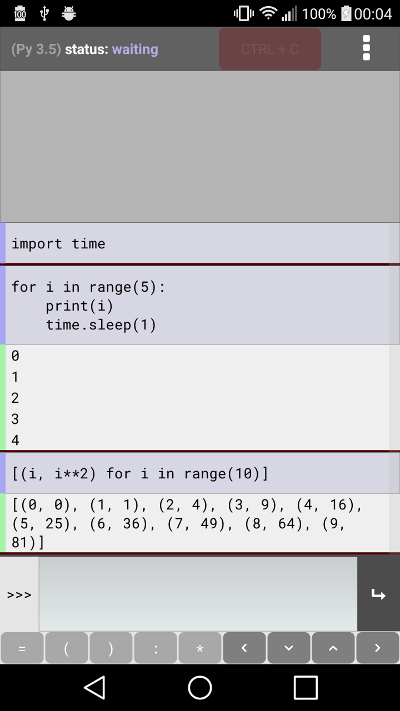

Pyonic interpreter
==================

A Python interpreter interface for mobile devices. Pyonic interpreter
is available for Android on Google Play, for `Python 2
<https://play.google.com/store/apps/details?id=net.inclem.pyonicinterpreter>`__
or `Python 3
<https://play.google.com/store/apps/details?id=net.inclem.pyonicinterpreter>`__. The
app can also be run under Kivy on the desktop (Linux, OS X/macOS,
Windows).

The Pyonic interpreter user interface is created in Python using `Kivy
<https://github.com/kivy/python-for-android>`__. User input is passed
to a second interpreter, run as a separate process via an Android
service. The interpreter is packaged for Android using
`python-for-android <https://github.com/kivy/python-for-android>`__.
Pyonic interpreter is written for and tested with both Python 2 and
Python 3.

Future targets include support for multiple interpreters,
different kinds of Python tasks (app threads, background services),
and editing/running Python files.

This app should in principle run on iOS with the addition of backend
code to start the interpreter subprocess (although I don't know what
the appropriate iOS mechanism would be). If anyone would like to try
this, feel free to ask any questions about the process.

Building
--------

To run on a desktop, simply clone from github and run :code:`python
pyonic/main.py` from the cloned dir. You will need Kivy and argparse
installed, but other dependencies are fairly minimal.

Installing with setup.py may work, but this hasn't been tested and
this doesn't yet install a command line shortcut.

To build for Android, install python-for-android, modify the hardcoded
ndk-dir in ``setup.py``, and run::

  python setup.py apk

You may need to install python-for-android from the github master
branch for this to work.

Technical details
-----------------

Pyonic interpreter runs as a Kivy application, starting a second process
in the background (a subprocess on desktop, a service on Android) to
run the Python code input. The output streams of this second process
are redirected to be formatted in Kivy labels in the main app.

This method seems quite crude, although it works well. An immediate
improvement will be to check how other similar projects do the same
thing.

Communication between processes is achieved using osc (specifically,
the implementation shipped with Kivy). There are probably much better
ways to do this nowadays, such as zeromq. These will be investigated
in the future.

Todo
----

Editor:
    - code completion
    - linting?
    - run code (different screen?)
    - abstract InterpreterInput and MenuButton for both usages
    - multiple file support (navigation drawer?)

Before next release:

Near future:
    - Add optional button rows (numbers, more symbols)
    - Improve message if interpreter is not responding on resume
    - Make initialising logo appear before unpacking
    - Check out keyboard issues
    - Unify handling of python2/python3 differences via a module

Eventually:
    - Halt thread on service exit
    - Save to file button
    - Add an 'About' page
    - Setting for scrollback length
    - Add linting

ctypes problem
--------------

Works on:

- LG G4 (Android 6.0)
- Moto E (Android 6.0)

Fails on:

- Nexus 4
- Galaxy Note 2
- Sony xperia z1 compact
- Samsung Galaxy J1 (Android 5.1.1)

crashes
-------

http://allview.ro/a4-you.html (A4 You)

