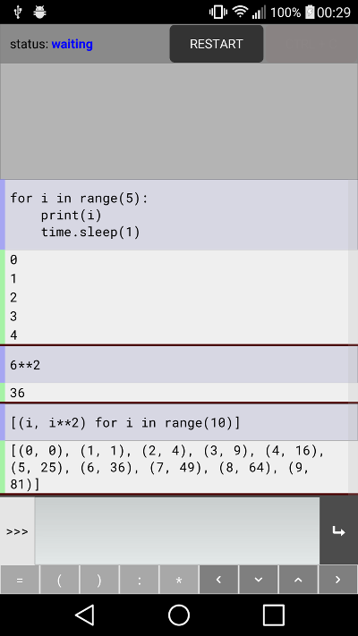

PyDE interpreter
================

An experimental Python interpreter interface for mobile devices,
written in Python.

The PyDE interpreter user interface is created in Python using `Kivy
<https://github.com/kivy/python-for-android>`__. User input is passed
to a second interpreter, run as a separate process via an Android
service. The interpreter is packaged for Android using
`python-for-android <https://github.com/kivy/python-for-android>`__.

PyDE interpreter is built and tested with Python 2. Python 3 also
works, but requires some fixes in Kivy's osc library. A Python 3
release will be a main target following the initial Python 2 release.

Future targets include support for multiple interpreters,
different kinds of Python tasks (app threads, background services),
and editing/running Python files.

This app should in principle run on iOS with the addition of backend
code to start the interpreter subprocess (although I don't know what
the appropriate iOS mechanism would be). If anyone would like to try
this, feel free to ask any questions about the process.

Building
--------

To run on a desktop, simply clone from github and run :code:`python
pyde/main.py` from the cloned dir. You will need Kivy and argparse
installed, but other dependencies are fairly minimal.

Installing with setup.py may work, but this hasn't been tested and
this doesn't yet install a command line shortcut.

To build for Android, install python-for-android, modify the hardcoded
ndk-dir in ``setup.py``, and run::

  python setup.py apk

You may need to install python-for-android from the github master
branch for this to work.

Technical details
-----------------

PyDE interpreter runs as a Kivy application, starting a second process
in the background (a subprocess on desktop, a service on Android) to
run the Python code input. The output streams of this second process
are redirected to be formatted in Kivy labels in the main app.

This method seems quite crude, although it works well. An immediate
improvement will be to check how other similar projects do the same
thing.

Communication between processes is achieved using osc (specifically,
the implementation shipped with Kivy). There are probably much better
ways to do this nowadays, such as zeromq. These will be investigated
in the future.

Todo
----

- Fix total crash on unicode input decoding
- defocus textinput on pause
- hide icon bar when textinput not focused

- Allow swiping to remove old entries

- Improve EOF related error when expecting indent
- Could add linting (fix bugs before running code)
